# StudyRoom - 自习室预约系统

基于 Spring Boot + Vue + 微信小程序的全栈自习室座位预约管理平台，支持多楼层/多自习室选座、预约签到、会员卡体系、运营数据看板、分布式并发控制等完整业务闭环。


---

## 功能概览

### 顾客端（微信小程序）

- 选座预约：按楼层 → 自习室 → 座位 → 时段的层级流程选择
- 入座签到/签退：到点自动结束，也可主动签退
- 会员卡购买与激活：有效期内预约 0 元入座
- 学习统计：个人学习时长、次数统计
- 预约记录：查看历史预约与当前订单
- 公告中心：查看自习室公告与通知

### 管理端（Web 后台）

- 运营看板：ECharts 图表展示预约趋势、营收数据
- 座位管理：楼层、自习室、座位网格的增删改查
- 预约管理：预约列表、状态流转、CSV 导出
- 用户管理：注册用户列表与管理
- 公告管理：发布与编辑自习室公告
- 会员管理：会员卡配置与订单管理
- 营收统计：收入报表与数据分析

### 技术亮点

- 分布式并发控制：Redisson 分布式锁 + Lua 原子 bitmap，防止座位超卖
- 定时调度：未签到自动释放、到期自动结束
- 按钮级权限：`@RequiresPerm` 注解 + RBAC 权限模型
- 审计日志：`@SysLog` AOP 切面记录操作日志
- 全局异常处理：统一 JSON 返回，前端友好提示
- 分包加载：小程序分包优化首屏加载速度

---

## 项目结构

```
studyroom/
├── studyroom-java/          # 后端 Spring Boot 服务
│   ├── pom.xml
│   └── src/
├── studyroom-vue/           # 管理端 Vue 2 + Element UI
│   ├── package.json
│   └── src/
├── studyroom-wx/            # 微信小程序（原生 + Vant Weapp）
│   ├── app.json
│   ├── pages/               # 主包页面（首页、入座、我的、登录）
│   └── subpackages/         # 分包页面（注册、预约详情、会员等）
└── docs/                    # 运维与对接文档
```

| 模块 | 技术栈 | 端口 |
|------|--------|------|
| `studyroom-java/` | Java 22, Spring Boot 3.4.2, MyBatis-Plus, Redis, MySQL | 8081 |
| `studyroom-vue/` | Vue 2, Element UI, ECharts | 9528 |
| `studyroom-wx/` | 微信小程序原生, Vant Weapp | - |

---

## 效果预览

### 小程序端

<table>
  <tr>
    <td align="center"><b>首页</b></td>
    <td align="center"><b>选座预约</b></td>
    <td align="center"><b>选座详情</b></td>
  </tr>
  <tr>
    <td>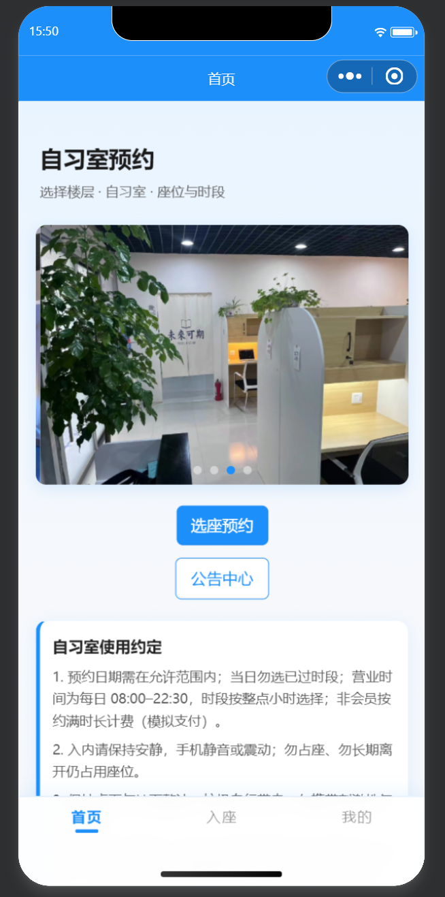</td>
    <td>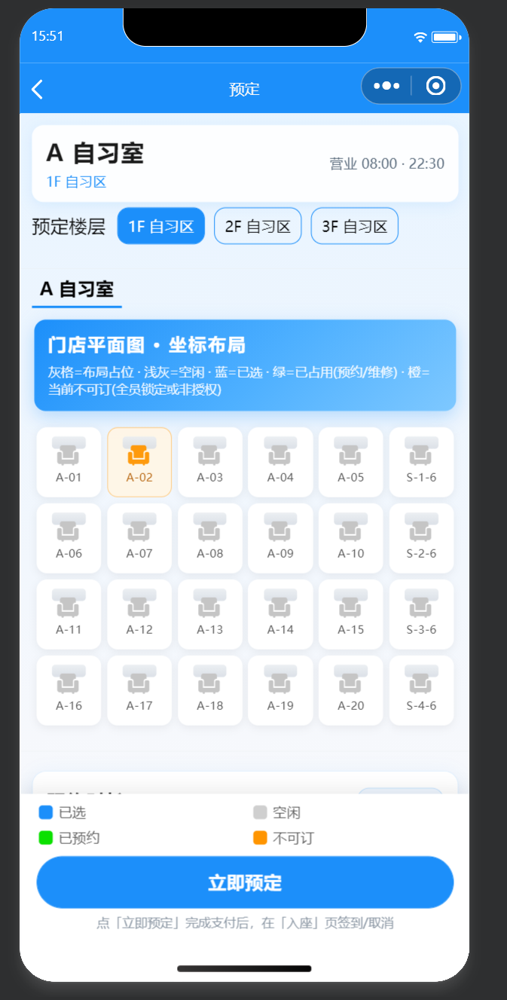</td>
    <td>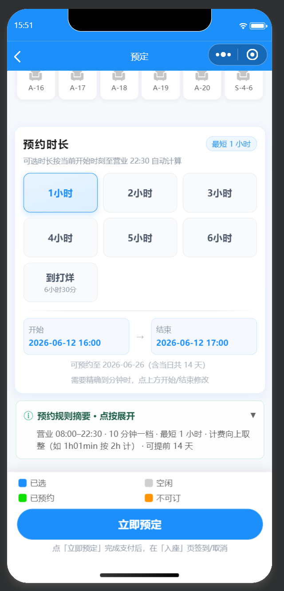</td>
  </tr>
</table>

<table>
  <tr>
    <td align="center"><b>入座管理</b></td>
    <td align="center"><b>个人中心</b></td>
    <td align="center"><b>登录注册</b></td>
  </tr>
  <tr>
    <td>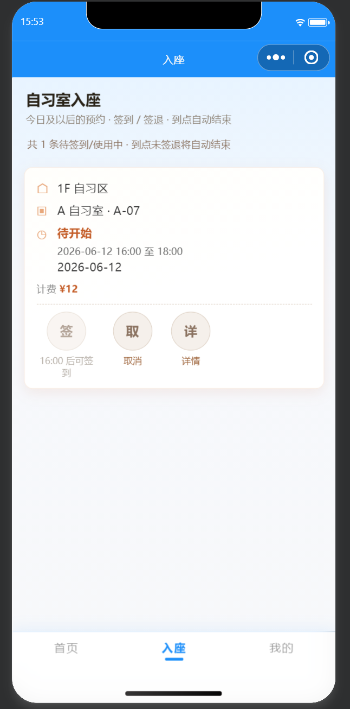</td>
    <td>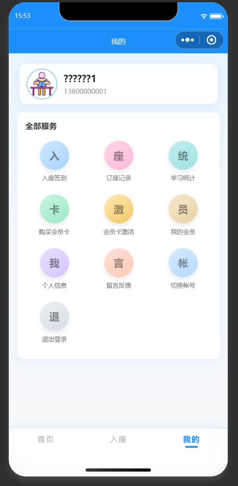</td>
    <td>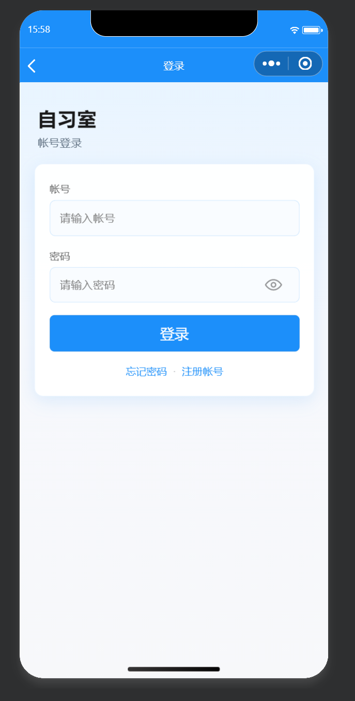</td>
  </tr>
</table>

<table>
  <tr>
    <td align="center"><b>预约记录</b></td>
    <td align="center"><b>会员卡</b></td>
    <td align="center"><b>购买会员卡</b></td>
  </tr>
  <tr>
    <td>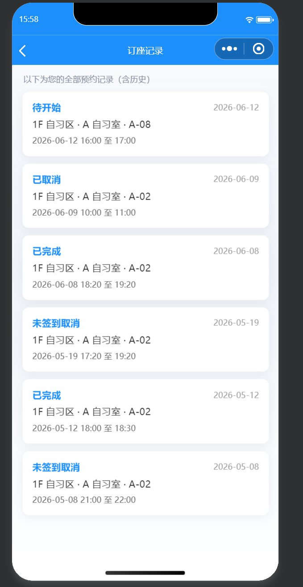</td>
    <td>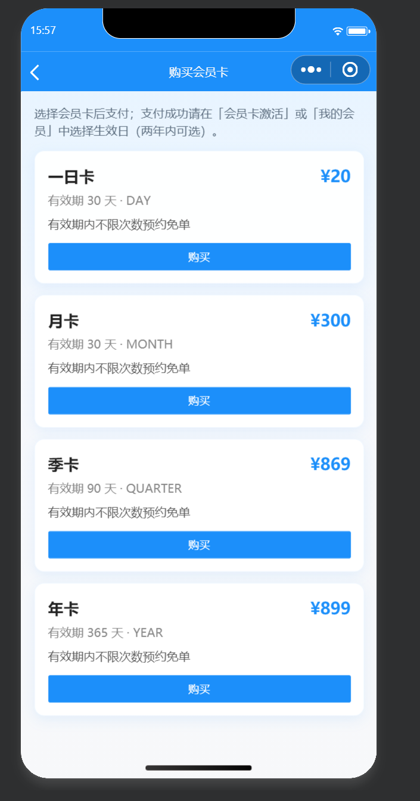</td>
    <td>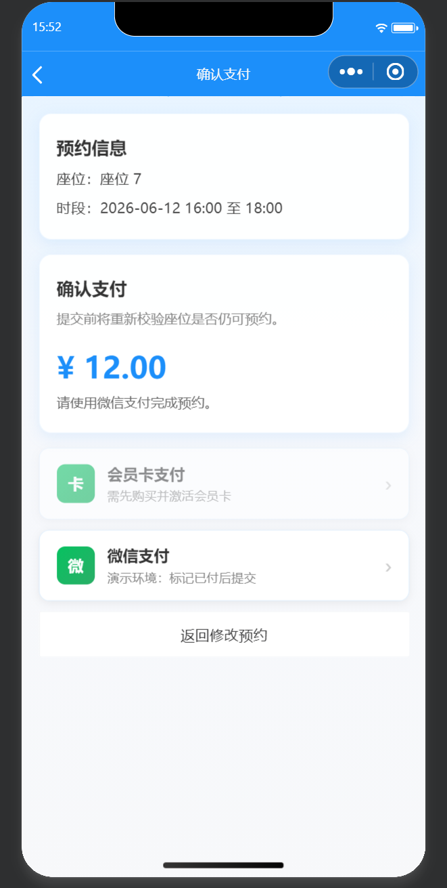</td>
  </tr>
</table>

### 管理端

<table>
  <tr>
    <td align="center"><b>运营看板</b></td>
    <td align="center"><b>座位管理</b></td>
  </tr>
  <tr>
    <td>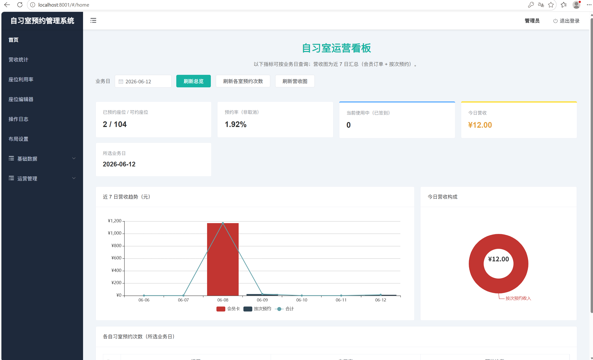</td>
    <td>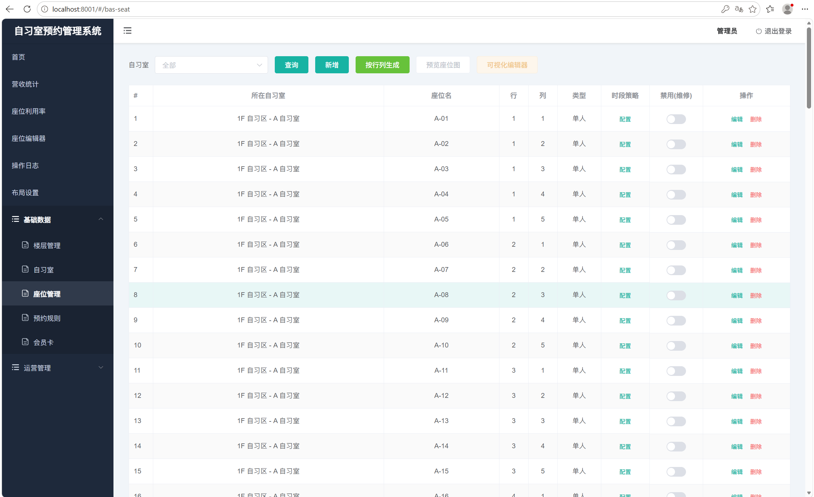</td>
  </tr>
</table>

<table>
  <tr>
    <td align="center"><b>预约管理</b></td>
    <td align="center"><b>操作日志</b></td>
  </tr>
  <tr>
    <td>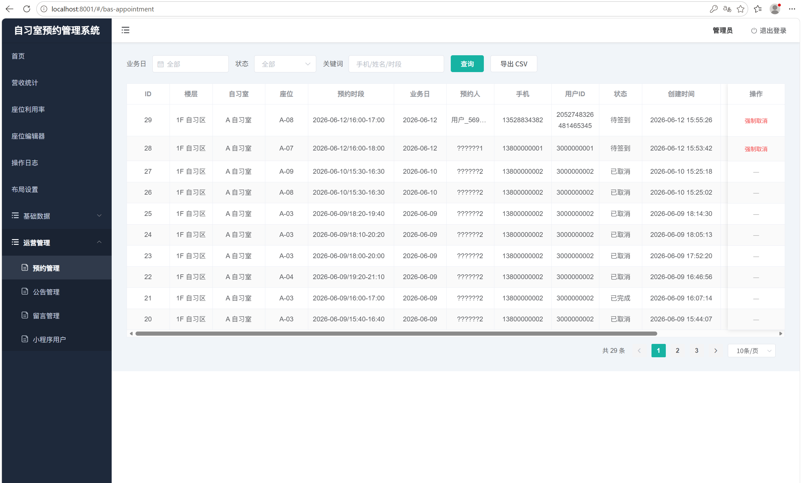</td>
    <td>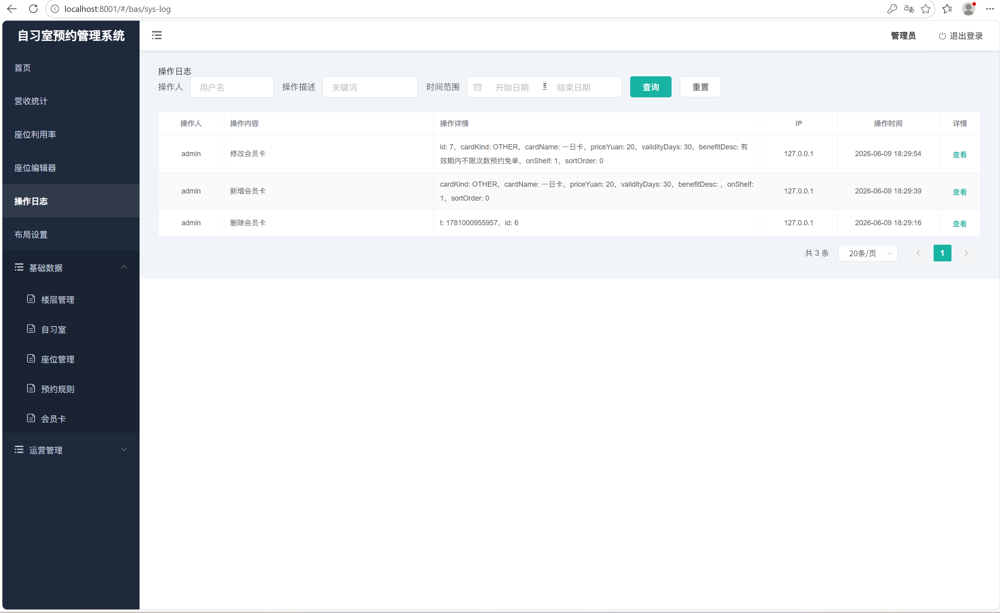</td>
  </tr>
</table>

---

## 快速启动

### 环境要求

| 组件 | 版本 |
|------|------|
| JDK | 22+ |
| Node.js | 18+（推荐 22） |
| MySQL | 8.0 |
| Redis | 7.0 |
| 微信开发者工具 | 最新版 |

### 1. 启动后端

```bash
# 1. 创建数据库并执行建表脚本
mysql -u root -p < studyroom-java/src/main/resources/db/schema-studyroom-core.sql
mysql -u root -p < studyroom-java/src/main/resources/db/schema-studyroom-seed-three-floors.sql

# 2. 启动 Spring Boot
cd studyroom-java
mvn spring-boot:run
```

后端默认监听 `8081` 端口，context-path 为 `/self-study`。

### 2. 启动管理端

```bash
cd studyroom-vue
npm install
npm run dev
```

访问 http://localhost:9528，默认管理员帐号见数据库 `sys_admin` 表。

### 3. 启动小程序

1. 用微信开发者工具导入 `studyroom-wx/` 目录
2. 修改 `utils/config.js` 中 `baseUrl` 为后端地址
3. 开发者工具中编译运行

---

## 配置说明

### 后端配置

开发环境使用 `application-dev.yml`，生产环境复制模板：

```bash
cp studyroom-java/src/main/resources/application-prod.example.yml \
   studyroom-java/src/main/resources/application-prod.yml
```

关键配置项（支持环境变量覆盖）：

| 配置项 | 说明 |
|--------|------|
| `server.port` | 服务端口，默认 8081 |
| `spring.datasource.druid.url` | MySQL 连接地址 |
| `spring.data.redis.host` | Redis 地址 |
| `STUDY_ADMIN_JWT_SECRET` | 管理端 JWT 密钥 |
| `APPLET_JWT_SECRET` | 小程序 JWT 密钥 |
| `study.captcha.memory-fallback` | 验证码内存降级 |

### 小程序配置

`studyroom-wx/utils/config.js`：

```javascript
module.exports = {
  // 模拟器用 127.0.0.1，真机调试用电脑局域网 IP
  baseUrl: "http://127.0.0.1:8081/self-study",
};
```

---

## 并发安全设计

座位预约的核心难点在于防止同一座位在同一时段被重复预约。本项目采用双重保障：

1. **Redisson 分布式锁**：预约时加锁，确保同一时刻只有一个请求能创建预约
2. **Lua 原子 bitmap**：座位占用状态存储在 Redis bitmap 中，通过 Lua 脚本原子性地检查并设置，避免超卖

---

## 部署

项目支持 Docker 部署与传统部署，详见 [运维文档](docs/STUDYROOM-OPERATIONS.md)。

### 快速部署

```bash
# 后端打包
cd studyroom-java
mvn clean package -DskipTests

# 管理端打包
cd studyroom-vue
npm run build
```

- 后端 JAR：`studyroom-java/target/studyroom.jar`
- 管理端静态文件：`studyroom-vue/dist/`

---

## 相关文档

- [运维与本地开发说明](docs/STUDYROOM-OPERATIONS.md)
- [微信支付/短信/订阅消息对接](docs/PRODUCTION-INTEGRATIONS.md)
- [小程序真机调试说明](docs/STUDYROOM-MINIPROGRAM-DEVICE.md)

---

## License

MIT
